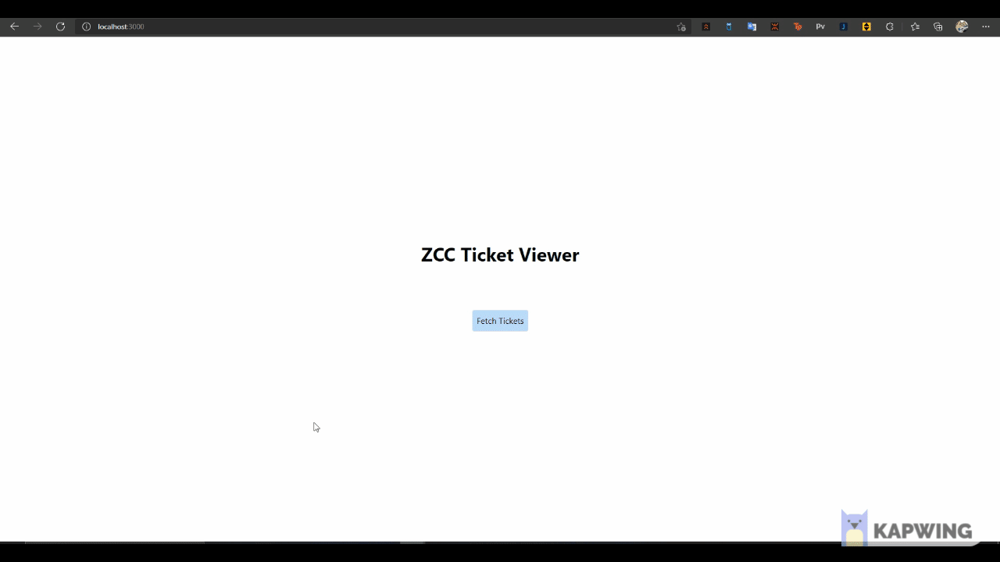

# Zendesk Summer 2020 internship coding challenge

A bare bones application based on nodejs and reactjs. Used tailwind for styling the react app.



## Technologies used

For the backend server
```
nodeJS
expressJS
dotenv
nodemon
```

For the application
```
reactJS
react-dom-router
cors
react-paginate  #for Pagination
tailwind-css
react-bootstrap
react-dom
yarn
```

For Backend Testing 
```
chai
chai-http
```

# Usage

from both backend and frontend folder
```
npm install
```

## Starting the backend nodejs server

Before starting the backend server change the environment variables in the dummy .env file in backend folder, replace 
  1. {subdomain} with your subdomain,
  2. {user id or user_token} with user id or taken
  3. {password or auth_token} with the password or generated oauth token

For example -
```
URL = "https://mysubdomain.zendesk.com/api/v2/tickets.json"
USER = "abc@gmail.com/token"
TOKEN = "8JRyFE0wybPIrerkayBbG12himcyMrxYpJHZiw7k"
TICKET_URL = "https://mysubdomain.zendesk.com/api/v2/tickets/"
```

from backend folder
```
nodemon start server.js
```
The backend is hosted on localhost:8000

## Starting the frontend react app

from frontend folder

```
npm install -g yarn
yarn start
```

The application is hosted at localhost:3000 and can be accessed through that link.

# Testing

### Backend testing

from backend folder

```
mocha --exit test\getTickets.js
```
